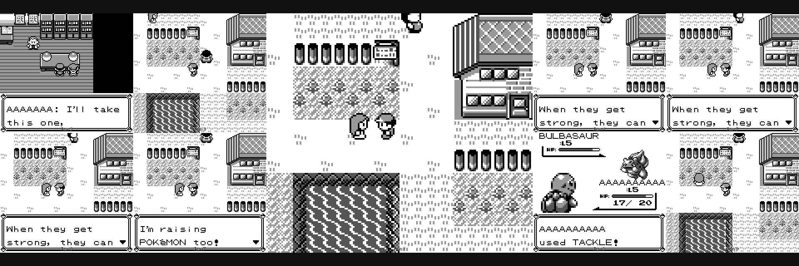

# Pokemon Agent

> The streaming, self-healing evolution of [pokemon](https://github.com/pcc-labs/pokemon): gameplay events flow through a local Kafka + Flink stack for real-time anomaly detection, and the agent's own telemetry drives automatic parameter tuning and LLM-proposed code fixes.



Autonomous Pokemon Red player that reads game memory, makes strategic decisions, and plays headlessly inside a stereOS VM. Everything it does streams as structured events, and everything it streams feeds a pipeline that heals it.

## The Self-Healing Pipeline

Three loops, each engaging only when the one before it runs out:

```
run finishes → fitness JSON
  ├─ healthy → nothing happens
  ├─ anomaly rule fires → HEALER races parameter variants, persists a
  │    measured winner to notes.md (the next run loads it automatically)
  └─ tuning exhausted (fix didn't hold / races keep rejecting)
       → escalation queue → DISCOVERY ENGINE: Claude Code proposes a code
         change in an isolated worktree; the engine runs the gates (full
         test suite + fitness eval) and opens a PR. A human merges.
```

- **Detect** — [Flink SQL jobs](#flink-anomaly-detection) flag stuck loops, battle wipes, and deadlocks from the live event stream; alerts land in the agent's [observational memory](#observational-memory).
- **Tune** — the [healer](#self-healing-loop) turns a bad run's own fitness into a parameter race: measured, margin-gated, cooldown-protected.
- **Grow** — the [discovery engine](#discovery-engine-capability-healing) turns exhausted tuning into gated code-change proposals. Tuning fixes the knobs that exist; this is the loop growing new knobs.

## Talk & Demo

- **[Slides](https://docs.google.com/presentation/d/1cRwYlDrB4s_98LaCUq-H0Zo6_4li87DslH4ozLn2wbM/edit)** — "Training AI on Your Own Code"
- **[Talk demo outline](docs/talk-demo-outline.md)** — the narrative and beat sheet
- **[Demo prompts](docs/demo-prompts.md)** — copy-paste prompts to drive each beat live
- **[Worktree setup](docs/worktree.md)** — isolated, pinned-state worktrees per beat
- **[Replayable demo runs](demo-runs/)** — committed frames + events; replay with `uv run python -m viewer --runs-dir demo-runs`

### Keeping a run

Runs are only written to `--runs-dir` when you ask for them:

| Flags | Result |
|-------|--------|
| *(neither)* | nothing written |
| `--live` | streams to the viewer, and the run folder is deleted when the run ends |
| `--record` | run folder kept |
| `--live --record` | streams *and* keeps the folder |

`--live` still writes the folder while the run is in flight — that's how the viewer
serves the orange live tile — it just cleans up after itself, so watching a run
doesn't quietly fill `runs/`. Add `--record` when you want to replay it afterwards
or draft a fix prompt from it (HEAL reads `summary.json`, which only a kept run has).

## Architecture

```
stereOS VM (/workspace)
┌──────────────────────────────────────────────────┐
│                                                  │
│  PyBoy (headless, window="null")                 │
│    ↓ memory addresses                            │
│  MemoryReader → BattleState / OverworldState      │
│    ↓                                             │
│  Strategy Engine (heuristic or LLM)              │
│    ↓ button inputs                               │
│  GameController → PyBoy                          │
│                                                  │
│  paperd ← proxies LLM API calls, records sessions│
│                                                  │
└──────────────────────────────────────────────────┘
  ↕ shared mount (./ ↔ /workspace)
Host: frames/  pokedex/
```

The agent runs a tight loop: read game state from known memory addresses, pick an action, send button inputs, tick the emulator forward. No display server needed. Screenshots come from PyBoy's internal frame buffer (`screen.ndarray`), not from the OS.

**Shared mount permissions.** The `[[shared]]` mount in `jcard.toml` maps `./` on the host to `/workspace` in the VM. Files keep their host ownership (UID 501 on macOS), but the VM runs as `admin` (UID 1000). This means host-created directories are read-only inside the VM by default. The install script opens write permissions on output directories (`frames/`, `pokedex/`) so the agent can write session data that persists back to the host.

## Quickstart

### stereOS (recommended)

```bash
mb up          # boot the VM, install deps, start the agent through Paper
mb attach      # watch it play
```

The VM configuration lives in `jcard.toml`. It mounts the repo at `/workspace`, installs Python + PyBoy, and runs the agent. `paperd` is assumed to be running on the host (authenticate the `paper` CLI with `paper status` first); it proxies the agents' LLM calls via `ANTHROPIC_BASE_URL`.

### Local

```bash
bash scripts/install.sh
uv run scripts/agent.py rom/pokemon_red.gb --strategy heuristic --max-turns 1000
```

Add `--save-screenshots` to capture frames every 10 turns into `frames/`.

> You must supply your own legally obtained ROM file in `rom/`.

## How It Works

**Game loop.** Each turn the agent ticks PyBoy forward, reads memory, decides, and acts. Turns are cheap — headless mode removes the 60fps cap and all rendering, so the emulator runs ~100x faster than real-time. The agent runs hundreds of thousands of them to progress through the game.

**Memory reading.** `MemoryReader` pulls structured data from fixed addresses in Pokemon Red's RAM: battle type, HP, moves, PP, map ID, coordinates, badges, party state. These addresses are specific to the US release.

**Battle strategy.** When a battle is detected (`0xD057 != 0`), the agent evaluates available moves using a type effectiveness chart, picks the highest-damage option, and manages healing and switching. The heuristic strategy requires no API calls.

**Overworld navigation.** Outside battle, the agent follows waypoints defined in `references/routes.json`. It handles early-game scripted sequences (Red's room to Oak's lab) and general map-to-map routing. A stuck counter triggers random movement to break out of loops.

## Paper Traces

**What is Paper?** [Paper](https://papercompute.com) is an LLM session recorder: `paperd`, a local daemon, sits in front of the Anthropic API and transparently captures every request/response pair the agent makes. Point the agent at it via `ANTHROPIC_BASE_URL` and no code changes are needed — the recording happens at the proxy layer, not in `scripts/agent.py`.

This is distinct from the [Kafka Telemetry Pipeline](#kafka-telemetry-pipeline) below. Paper records *LLM* activity — what Claude was asked, what it decided, how many tokens it burned, at what cost — one entry per agent session. Kafka streams *game* activity — battles, movement, map changes — as structured events, independent of whether an LLM is involved at all (the heuristic strategy makes zero API calls and has nothing for Paper to record). The two pipelines don't depend on each other: run with `--strategy heuristic` and Paper stays empty; run without Docker Compose up and Kafka stays empty. Together they answer two different questions — "what did the agent think?" (Paper) and "what did the agent do?" (Kafka).

Each agent session appears in the Paper dashboard with its own session ID, turn count, and cost. When the multi-agent runner spawns variants via `paper start claude`, each one is a full, independently recorded Claude Code session. Authenticate the `paper` CLI once with `paper status` before launching.

## Observational Memory

Inspired by [Mastra's observational memory](https://mastra.ai/blog/observational-memory), this system reads recorded Paper sessions, extracts noteworthy events via heuristic pattern matching (no LLM calls), and writes prioritized observations to memory files.

`paper_reader.py` is a two-source hybrid: it discovers sessions through the local paperd API (filtered to this working directory) and reads their transcript content from the Claude Code JSONL files under `~/.claude/projects/`. When paperd is unavailable, it falls back to scanning the JSONL directory directly, so observation still works offline. The observer walks each session, identifies patterns (errors, file creations, token usage), and writes observations to `pokedex/memory/`.

```
pokedex/memory/
├── observations.md      # date-grouped observations with priority tags
└── observer_state.json  # watermark tracking processed sessions
```

**What it extracts:**
- Session goals (first user message)
- Tool errors and exception tracebacks
- Files created during the session
- Token usage summaries

Each observation is tagged `[important]`, `[possible]`, or `[informational]` based on keyword matching (e.g. bug/error/crash are important, test/refactor are possible).

```bash
# Preview observations without writing
uv run scripts/observe_cli.py --dry-run

# Process all unprocessed sessions
uv run scripts/observe_cli.py

# Reprocess everything from scratch
uv run scripts/observe_cli.py --reset

# Process a single session by ID
uv run scripts/observe_cli.py --session <harness_session_id>
```

Sessions are discovered from paperd (read from `ANTHROPIC_BASE_URL`), or from the local JSONL transcripts when paperd is offline. The watermark in `observer_state.json` is stamped with the reader identity and auto-resets if the reader changes, so upgrades don't reprocess old sessions.

## Kafka Telemetry Pipeline

The agent emits real-time **game events** (`pokemon.game.v1`) as JSONL via `scripts/publisher.py` — it never touches the broker. The `game-event-bridge` service tails that sink and produces each event to the local `agent.game.events` topic, so the stream is live while the agent runs; on first start it replays the whole sink (`FROM_BEGINNING=1`), so the topic is populated even before a fresh run. Downstream consumers and Flink jobs process the stream in real time. (LLM sessions are recorded separately by Paper; see [Observational Memory](#observational-memory).)

```
Agent → JSONL (data/telemetry/game/*.jsonl)
  └→ game-event-bridge → Kafka (agent.game.events)
            ├→ game-consumer (prints + writes JSONL)
            ├→ Flink SQL (anomaly detection)
            │    └→ Kafka (agent.telemetry.alerts)
            │         └→ alerts-consumer (prints + observations + advice)
            │              └→ pokedex/memory/inbox (advice.jsonl)
            │                   └→ Agent polls mid-run  ← the loop closes here
            └→ DuckDB (ad-hoc queries on JSONL sink)

JSONL sink (data/telemetry/*.jsonl)
  └→ dlt pipeline → DuckDB warehouse (local)
```

Each event carries the event type (`battle`, `overworld`, `map_change`, `stuck`, `milestone`, `session`), turn, timestamp, `run_id`/`event_id` (partitioning and dedup identity), and a flat data payload (map, position, HP, action, badges, …). Flink reads these to flag navigation deadlocks and battle loops in real time: `GAME_STUCK_LOOP`, `BATTLE_WIPE`, `BATTLE_LOOP`, `POSITION_DEADLOCK`, `NO_PROGRESS`.

```bash
# Start the full pipeline (Kafka, Flink, bridge, consumers)
docker compose up -d

# Run the agent with telemetry — events reach the topic live via the bridge
uv run scripts/agent.py rom/pokemon_red.gb --strategy low --max-turns 500

# Watch raw game events
docker compose logs -f game-consumer

# Watch the bridge tail the JSONL sink
docker compose logs -f game-event-bridge

# Watch anomaly alerts
docker compose logs -f alerts-consumer

# Flink dashboard
open http://localhost:8081
```

LLM sessions are recorded by Paper (paperd) on the host — point the agent at it with `ANTHROPIC_BASE_URL`. A local-first alternative for the game-event stream exists without a broker: pass `--telemetry-dir` to the agent and it writes JSONL files directly via `scripts/publisher.py`.

### Closing the loop: the advice inbox

Feedback flows back into a *live* run the same way telemetry flows out — as JSONL. Writers (the Flink alerts-consumer, an operator, or a future cassette) append `pokemon.advice.v1` lines to an inbox directory; the agent polls new complete lines between turns and applies them mid-run:

- `genome_patch` — hot-applies navigation knobs through the healer's clamp rules
- `note` — lands in strategy notes and the Pokédex feed as a milestone

```bash
uv run scripts/agent.py rom/pokemon_red.gb \
  --max-turns -1 \
  --advice-inbox pokedex/memory/inbox \
  --output-json data/telemetry/live_fitness.json --fitness-every 500
```

`--max-turns -1` runs unlimited (the long-loop mode) and `--fitness-every` keeps rewriting the fitness JSON so healer rules and observers can evaluate a live window on a run that never ends. Every advice line carries an `id` (deduped per run) and an `expires_at` TTL, so at-least-once writers are safe and stale anomalies can't steer a run that has already moved on. The alerts-consumer writes Flink anomaly alerts into the inbox when `ADVICE_INBOX_DIR` is set (on by default in compose).

## Flink Anomaly Detection

Apache Flink (1.18) runs SQL jobs against the `agent.game.events` stream:

| Job | Window | Trigger | What it catches |
|---|---|---|---|
| `GAME_STUCK_LOOP` | 60s tumbling | 5+ stuck events on a map | Navigation stuck on one tile |
| `BATTLE_WIPE` | 5min tumbling | Player HP hits 0 | Party wipe / failed battle |
| `BATTLE_LOOP` | 30s tumbling | 20+ battle events at same enemy HP | Input spam not dealing damage |
| `POSITION_DEADLOCK` | 2min tumbling | 50+ overworld events at one position | Bouncing off an impassable obstacle |
| `NO_PROGRESS` | 5min tumbling | 100+ overworld events, ≤5 unique tiles | Navigation completely stalled |
| `LOW_HP_GRIND` | 2min tumbling | 10+ battle turns at ≤25% HP | Bleeding out with no heal (the blackout class) |
| `BATTLE_LOSS_STREAK` | 10min tumbling | 2+ lost battles | Out of its depth: level gap or no healing |

The jobs write alerts to the `agent.telemetry.alerts` Kafka topic. The alerts consumer picks them up and appends each as an `[important]` observation to `pokedex/memory/observations.md`, feeding anomalies into the observational memory the agent loads at session start — and, when `ADVICE_INBOX_DIR` is set, into the advice inbox a live run polls mid-run.

Flink SQL definitions live in `docker/flink-sql/init.sql`. The connector JAR is downloaded automatically at startup.

## Data Warehouse

The JSONL files in `data/telemetry/` serve as the universal interchange format -- the same files whether a Kafka consumer or the local publisher wrote them. The dlt pipeline is the load step that moves those files into a persistent, queryable warehouse.

dlt handles schema normalization and incremental loading. The destination is a one-line swap: `duckdb` for local development, `snowflake` for production. Both `query_telemetry.py` and `historical_observer.py` work against either source via the `--db` flag.

```bash
# Install dlt (optional dependency group)
uv sync --group dlt

# Load JSONL into a local DuckDB warehouse
uv run scripts/dlt_pipeline.py

# Load into Snowflake instead
uv run scripts/dlt_pipeline.py --destination snowflake

# Query the warehouse directly
uv run scripts/query_telemetry.py --db data/telemetry.duckdb

# Historical insights from the warehouse
uv run scripts/historical_observer.py --db data/telemetry.duckdb
```

Without `--db`, both query scripts fall back to scanning JSONL files directly -- nothing changes for existing workflows.

## AlphaEvolve Strategy Evolution

Inspired by [AlphaEvolve](https://arxiv.org/abs/2506.13131) (DeepMind), the agent can automatically improve its navigation parameters through headless evaluation runs. Instead of manually tuning thresholds, the evolution harness runs 10 agent variants in parallel, scores them against a composite fitness function, and keeps the winner.

**How it works.** The agent's navigator has tunable knobs: stuck threshold, door cooldown, waypoint skip distance, axis preference. The harness treats these as a genome. Each generation, it either asks an LLM to propose a mutation (informed by observer diagnostics) or randomly perturbs values. The variant runs headless, and its fitness is compared to the current best.

```bash
# Run the evolution harness (LLM-free random perturbation by default)
uv run scripts/evolve.py rom/pokemon_red.gb --generations 5 --max-turns 1000

# Run 10 parameter variants in parallel and rank them
uv run scripts/run_10_agents.py rom/pokemon_red.gb
```

The observer feeds failure context (stuck events, tool errors) into the LLM mutation prompt so variants target actual problems rather than making blind changes.

### Closing the loop: bounds, history, and stagnation detection

The case study below showed a clear gap: every run hit a plateau where the LLM proposed near-identical variants for multiple consecutive generations. Three mechanisms now close that loop:

**Parameter bounds enforcement.** `PARAM_BOUNDS` defines valid ranges for every evolvable parameter. `clamp_params()` enforces type coercion and clamping on all mutations, whether from the LLM or random perturbation. The LLM can no longer propose `stuck_threshold: -5` or `hp_run_threshold: 99.0`. Invalid enum values fall back to defaults. This replaced scattered ad-hoc `max(1, ...)` guards with a single source of truth.

**Variant history in the LLM prompt.** Each generation's outcome (score, improvement status, parameter diffs from defaults) is fed back into the next mutation prompt. The LLM sees a compact log of the last 10 generations and is instructed to avoid repeating failed combinations. In the case study, Run 4's Gen 8 breakthrough happened *despite* having no memory of prior attempts. Now the LLM starts every generation with full context of what has already been tried.

**Convergence detection with forced exploration.** `detect_stagnation()` fires when the last 3 generations all fail to improve. When triggered:
- The LLM receives a WARNING directive to make larger, multi-parameter changes
- The no-LLM fallback switches from `_perturb()` (1 param, small delta) to `_forced_exploration_perturb()` (3-4 params, 2x deltas, axis flip)

This is the mechanism that was missing in the case study. Run 1 locked into one axis preference for 9 stale generations. With stagnation detection, generation 4 would have triggered forced exploration, potentially finding the Gen 8-style breakthrough 4 generations earlier.

**First finding:** `door_cooldown=2` beats the default of 8. Shorter cooldown means fewer wasted turns walking away from doors before retrying. Confirmed across two milestones (Pokemon selection and rival battle) with 10 independent runs each.

### Self-healing loop

`scripts/healer.py` closes the loop with zero human input — and the agent chains it automatically: every `agent.py` run invokes `healer.py check` on its own fitness at session end. No wrapper needed; pass `--no-self-heal` to opt out (race children spawned by `evolve.run_agent` always do, so races can't recurse). The explicit chain still works for driving it by hand:

```bash
uv run scripts/agent.py rom/pokemon_red.gb --output-json fit.json --max-turns 2000 \
  && uv run scripts/healer.py check --fitness fit.json --rom rom/pokemon_red.gb
```

When the run's own fitness trips a rule — `navigation-thrash` (`stuck_count ≥ 12` or `backtrack_restores ≥ 3`), `terminal-wedge` (`max_stuck_streak ≥ 50`, one unrecovered wedge that episode-counting misses), or `no-progress` (`maps_visited ≤ 1` after 500+ turns) — the healer races seeded variants of the implicated parameters via `evolve.run_agent`, and persists the winner to `notes.md` (the same autotune genome block the agent loads at startup) only if it beats the current genome by a 5% margin. A 6-hour cooldown (`data/healer_state.json`) prevents race cascades, and `check` always exits 0 so a healing failure never breaks the wrapper. `--dry-run` shows the decision without racing.

The loop also closes **inside** a run: when the live agent's stuck streak crosses the terminal-wedge threshold (50), it saves its own wedged state, launches `healer.py check --rule terminal-wedge --load-state <wedge.state>` in the background, and keeps playing while the race runs candidates *from the wedge itself* — so the score directly measures escaping it. An accepted genome is hot-applied mid-run (navigator, backtracking, and door-cooldown knobs) and surfaces in the viewer feed as a milestone, with no operator involvement at all. One race per run; `--no-in-run-heal` opts out (race children always do), and `--in-run-heal-streak` moves the trigger. **The relay runs with it on**, one heal per lane: `healer.py` appends its winner to a notes file and the agent loads its baseline from one, so six parallel lanes pointed at the repo's `notes.md` would race each other for the shared genome — `--in-run-heal-notes` gives each lane a `genome.md` in its own variant dir, seeded with that lane's knobs, so a heal stays inside the lane that wedged. The relay keeps `--no-self-heal`: the *end-of-run* healer writes the shared `notes.md`, which a relay must not do once per lane. `run_evals.py` disables both — an eval's contract is determinism per (state, genome), and a hot-applied genome would break it. Cost of a heal, measured: a race candidate is 800 turns ≈ 4.4 s at 67 MB peak RSS, so one race (control + 6 variants, sequential) is ~31 s, and six lanes wedging at once peak at ~400 MB for half a minute — small next to the six lane processes the relay already runs. `--parallel` remains the knob that sizes a relay to the machine.

### Fanning a race out (optional)

A parameter race is N independent short runs, and `run_race` executes them serially on one machine. `scripts/fanout/` adds an optional backend seam so the same work list can run somewhere with more parallelism. **Local is the default and nothing above changes** — the serial loop is still what every existing caller gets.

```bash
# default: serial, on this machine, no account needed
uv run scripts/fanout/cli.py --rom rom/pokemon_red.gb --variants 3

# opt-in: one Daytona sandbox per arm
uv sync --group fanout
bash scripts/fanout/build_snapshot.sh --push
uv run scripts/fanout/cli.py --rom rom/pokemon_red.gb --variants 3 \
  --backend daytona --snapshot pokemon-fanout-<sha>
```

The snapshot is the Daytona equivalent of the stereOS image: repo, deps, headless PyBoy, and the `tapes` capture sidecar. It contains **no ROM and no credentials** — the ROM is uploaded per sandbox (it is not ours to redistribute) and the DSN, capture URL, and API keys are injected at launch, so a rotated key never forces a rebuild. `build_snapshot.sh` fails the build if a ROM is found in the image.

The heuristic tier (`--strategy low`, the default) makes zero LLM calls, so racing costs only sandbox-seconds — an 8-arm 1000-turn race measured 57s wall, ~2¢. At `--strategy medium|high` each arm proves its capture path with one real per-arm heartbeat call routed through the central proxy (`agent.py` has no in-process LLM client yet — `should_call_llm` has no caller — so the heartbeat is what lands in the store until that path exists). Those runs cost money, which the runner warns about before starting. GPU sandboxes exist too (an H100 80GB via the `daytona-gpu` snapshot); the race arms don't need one, but the [bench host](#daytona-gpu-bench-host) does.

Two operational notes, both measured: org accounts default to a **5-sandbox concurrency ceiling** (wider races run in waves; `--concurrency 5` matches it), and when the `daytona` CLI is absent, `build_snapshot.sh` builds server-side through the SDK from a git-clean staged context instead.

Teardown has three layers because a leaked sandbox bills silently: every arm deletes in a `finally`, the batch sweeps stragglers on interrupt, and `ephemeral=True` plus `ttl_minutes` let the server reap on its own if the driver is killed outright.

`bash scripts/fanout/prove.sh --rom <rom> --snapshot <name>` runs a bounded 3-arm proof and checks that fitness came back for every arm, that all three heartbeats landed in the central tapes store as one queryable cohort, that zero sandboxes survive, and what a 20-arm race would cost from measured usage. Capture prerequisites, all defaulted from the machine's own setup: the DSN comes from `~/.tapes/config.toml`, and the capture URL derives from an active Tailscale funnel fronting a `tapes serve proxy --provider anthropic` on `:8093` (Postgres itself never leaves loopback).

### Daytona GPU bench host

`scripts/fanout/ollama_host.py` is the cloud arm of the model bench — a fourth `OLLAMA_HOST_URL` alongside pi, claude, and local/cloud ollama, with nothing downstream changing:

```bash
uv run --group fanout scripts/fanout/ollama_host.py up --models gpt-oss-120b   # H100 80GB, prints URL
OLLAMA_HOST_URL=<url> uv run python scripts/run_model_evals.py --models gpt-oss-120b
uv run --group fanout scripts/fanout/ollama_host.py down                       # or the TTL reaps it
```

Models are roster aliases: everything in `local_models.py` `ROSTER`, plus the H100-only `DAYTONA_ROSTER` tier for what the local 32 GB card can't hold (currently `gpt-oss-120b`, 65 GB — benched at ~70 tok/s across the full case suite). Measured session shape: sandbox in ~1s, ollama install ~6s, the pull dominates (~11 min for 65 GB at ~100 MB/s), evals in minutes. A persistent weights volume exists (`--volume fanout-ollama-models`) but is **off by default** on measured evidence — the FUSE mount reads 75–78 MB/s regardless of parallelism, slower than re-pulling — so it only earns its keep when the registry is down or rate-limiting. The preview URL is public while the host is up; the TTL bounds the exposure.

### Semantic router (the right bot for the right situation)

The skill matrix (benchmarks/2026-08-22-skill-matrix.md) measured which model wins each part of
the game; [vllm semantic-router](https://github.com/vllm-project/semantic-router) turns that
table into infrastructure. `references/semantic_router.yaml` routes model `vllm-sr/auto` by
keyword signals — battle → the Driver (laguna-xs), navigation → the best line (qwen38-27b),
puzzle → the deepest (kimi cloud) — through the tapes proxy, so routed sessions stay captured.
`scripts/semantic_router.py` validates, dry-runs, serves, and registers it with pi. See
[docs/semantic-router.md](docs/semantic-router.md).

### Discovery engine (capability healing)

Parameter tuning only tunes the knobs that exist. When tuning is exhausted — the same rule re-fires after an accepted fix, or the last two races both rejected — the healer escalates to `data/discovery_queue.json`, and the discovery engine turns the evidence into a **code change proposal**:

```bash
uv run scripts/discovery.py run --rom rom/pokemon_red.gb          # work the queue
uv run scripts/discovery.py run --rom rom/pokemon_red.gb --reason "wedges at the forest exit"  # manual/demo
```

There is a hand-driven on-ramp too, for when you want to read the proposal before
anything runs. `prompt` builds the same bundle and prints the prompt instead of
executing it — no worktree, no LLM call, no state written:

```bash
uv run scripts/discovery.py prompt --fitness runs/<id>/summary.json \
  --rule navigation-thrash --detail "waypoint goes stale on backtrack"
```

That is what the viewer's **HEAL** button calls: select an anomaly in the feed,
say what the agent got wrong, and copy out the prompt — which also reports
whether the healer already escalated that same run on its own. The operator
supplies one sentence; everything else in the prompt is assembled from evidence.

The engine builds a context bundle (escalation, recent races, observations tail, implicated code), hands it to Claude Code headless (`claude -p`, `--permission-mode acceptEdits`) in an isolated git worktree, then runs the gates itself — full test suite, ruff, and a fitness eval of the patched agent vs baseline (`--eval-runs`, same 5% margin as the healer; `--eval-runs 0` skips it and the PR is titled `[eval pending]`). Gates pass → it pushes the branch and opens a PR with the diagnosis and evidence; gates fail → the worktree and branch are discarded. **A human always merges** — the engine never touches main. One attempt per escalation, 24-hour cooldown, always exits 0.

### Long-session mode

You can still run the agent the traditional way for a single long session, the way [ClaudePlaysPokemon](https://www.twitch.tv/claudeplayspokemon) works on Twitch:

```bash
uv run scripts/agent.py rom/pokemon_red.gb --strategy heuristic --max-turns 50000
```

The two approaches complement each other. Long sessions are better for discovering new capabilities and debugging game-specific logic. The evolution loop is better for optimizing parameters once the code structure exists.

## autotune Integration

[autotune](https://github.com/pcc-labs/autotune) is a sibling training loop (Try → Check → Reward → Nudge) that runs this agent, scores each run against the canonical Route-1 story, and feeds what it learns back here. The agent has no runtime dependency on autotune; `scripts/autotune_bridge.py` reads autotune's output and degrades to no-ops when it is absent.

There are two consumer seams:

**Genome from `notes.md`.** autotune writes a genome block into `notes.md`:

```
<!-- autotune:genome
{"stuck_threshold": 8, "door_cooldown": 10, ...}
-->
```

The agent reads the last such block at startup and uses it as its `EVOLVE_PARAMS` baseline. The `EVOLVE_PARAMS` env var still overrides it, so behavior is unchanged when no block is present.

```bash
# With a genome block in notes.md, the agent applies it automatically:
uv run scripts/agent.py rom/pokemon_red.gb
```

**Local model as the evolve proposer.** `evolve.py` can use autotune's locally-trained MLX model as its mutation proposer instead of Claude. No API key is needed.

```bash
uv run scripts/evolve.py rom/pokemon_red.gb --llm local
```

`--llm` accepts `anthropic` (default, Claude), `local` (autotune's model via `mlx_lm generate`), or `none` (random perturbation). `--no-llm` still works.

See the [autotune integration doc](https://github.com/pcc-labs/autotune/blob/main/docs/pokemon-kafka-integration.md) for the full workflow.

## Testing

100% line coverage enforced via `pytest-cov` (`fail_under = 100` in `pyproject.toml`).

```bash
# Run the full test suite
uv run pytest

# Run a single test class
uv run pytest tests/test_agent.py::TestLabPokemonSelection -xvs
```

### Live integration test

Boot the agent against a real ROM and confirm it selects a starter Pokemon within 1000 turns:

```bash
mb up
# or locally:
PYTHONPATH=scripts .venv/bin/python scripts/agent.py "rom/Pokemon - Red Version (USA, Europe) (SGB Enhanced).gb" --max-turns 1000
```

The agent streams structured log lines as it plays. Look for `Party: 1` in the output to confirm a Pokemon was selected. A typical run selects a starter around turn 100 and wins the rival battle shortly after.

## Project Structure

```
pokemon-agent/
├── README.md                # this file
├── LICENSE                  # MIT license
├── CONTRIBUTING.md          # contributor guide
├── SKILL.md                 # skill definition for stereOS agents
├── jcard.toml               # stereOS VM configuration
├── frames/                  # screenshot output (gitignored)
├── rom/                     # user-provided ROM files (gitignored)
├── docker-compose.yml       # Kafka + Flink + bridge + consumers stack
├── docker/
│   ├── game-event-bridge/   # tails JSONL sink → agent.game.events topic
│   ├── game-consumer/       # game event consumer + JSONL writer
│   ├── alerts-consumer/     # anomaly alert consumer → pokedex/memory
│   └── flink-sql/
│       ├── init.sql          # Flink SQL anomaly jobs (game events)
│       └── submit-jobs.sh    # startup script for SQL client
├── scripts/
│   ├── install.sh           # setup: Python, PyBoy, checks paperd
│   ├── agent.py             # main agent loop + strategies
│   ├── memory_reader.py     # memory address definitions
│   ├── memory_file.py       # agent memory management
│   ├── paper_reader.py      # Paper API + JSONL transcript reader (stdlib only)
│   ├── observer.py          # heuristic observation extractor
│   ├── observe_cli.py       # CLI for running the observer
│   ├── publisher.py         # local-first JSONL telemetry publisher
│   ├── dlt_pipeline.py      # dlt warehouse loader (JSONL → DuckDB/Snowflake)
│   ├── historical_observer.py # cross-session insights via DuckDB
│   ├── query_telemetry.py   # ad-hoc telemetry queries
│   ├── memory_writer.py     # appends observations to pokedex/memory
│   ├── pathfinding.py       # collision map + backtrack manager
│   ├── evolve.py            # AlphaEvolve strategy evolution harness
│   └── run_10_agents.py     # parallel multi-agent evaluation runner
├── references/
│   ├── routes.json          # overworld waypoints
│   └── type_chart.json      # type effectiveness data
├── pokedex/
│   └── log1.md              # session log: stereOS setup notes
└── tests/                   # 100% coverage test suite
```

## Pokedex

The `pokedex/` directory contains session logs and development notes. Each log documents what happened during a run: setup blockers, fixes, observations about agent behavior. These serve as a record of how the project evolved and what the agent encountered.

## Speed Run Milestones

Target turn counts for community benchmarking. Fork it, improve the strategy, post your numbers.

| Milestone | Low | Medium | High |
|---|---|---|---|
| Get Charmander + beat rival | ~200 | ~200 | ~200 |
| Reach Viridian City | ~2,000 | ~1,000 | ~500 |
| Reach Pewter City | ~5,000 | ~3,000 | ~1,500 |
| Beat Brock (1st gym) | ~8,000 | ~5,000 | ~3,000 |
| Clear Mt. Moon | ~20,000 | ~10,000 | ~5,000 |
| Beat Misty (2nd gym) | ~30,000 | ~15,000 | ~8,000 |
| Beat Lt. Surge (3rd gym) | ~50,000 | ~25,000 | ~15,000 |
| 8 badges | ~200,000 | ~100,000 | ~60,000 |
| Elite Four | ~300,000 | ~150,000 | ~80,000 |

## Divide-and-Conquer Relay

`scripts/relay.py` splits the road to Mt. Moon into segments (Route 1 → Viridian Forest → Pewter →
Boulder Badge → Mt. Moon entrance) and races parallel decision variants over each: battle-survival
spreads on the forest leg, navigation spreads on traversal legs. Each lane runs `agent.py` with
`--stop-on-map`/`--stop-on-badge` so it self-terminates at the segment goal and dumps a save state;
the healthiest winner's state + WorldMap + genome become the next segment's baton.

```bash
uv run python scripts/relay.py --dry-run          # print every lane's command, launch nothing
uv run python scripts/relay.py                    # full relay: all four segments
uv run python scripts/relay.py --segments forest_to_pewter --seed-state data/relay/<run>/batons/route1_to_forest.state
uv run python scripts/relay.py --max-turns-scale 0.25   # quick smoke: quarter-length segments
```

Artifacts land in `data/relay/<run-id>/`: per-lane `agent.log` + `fitness.json`, `batons/*.state`,
and `report.json`. The `pewter_to_badge` segment also captures `batons/pre_brock.state` for the
autotune brock loop.

The while loop can also act as its own harness: with `--sideloop-every 500 --advice-inbox
data/advice`, the live agent snapshots its state every 500 turns and spawns
`scripts/sideloop.py` in the background — an AlphaEvolve subloop that races decision variants
from that snapshot, scores them with `evolve.score`, and feeds the winning genome back through
the advice inbox as a `genome_patch`. The game never stops; it just gets better mid-run.

## FLE-Style Backtracking

Inspired by the [Factorio Learning Environment](https://arxiv.org/abs/2503.09617)'s `BacktrackingAgent`, the agent snapshots game state at key moments (map changes, periodic intervals) and restores when stuck. This directly addresses navigation dead-ends like Route 1's y=28 blocker — instead of wasting turns in a loop, the agent reverts to a known-good state and tries an alternate path.

Snapshots use PyBoy's `save_state()`/`load_state()` with in-memory `BytesIO` buffers (~130KB each, <1ms). A bounded deque keeps the most recent 8 snapshots. Each snapshot tracks its restore count, and after 3 failed attempts from the same snapshot it's discarded. Four parameters control the behavior and are evolvable through AlphaEvolve:

| Parameter | Default | Description |
|---|---|---|
| `bt_max_snapshots` | 8 | Max snapshots in the deque |
| `bt_restore_threshold` | 15 | Stuck turns before restoring |
| `bt_max_attempts` | 3 | Retries per snapshot |
| `bt_snapshot_interval` | 50 | Periodic snapshot frequency |
| `hp_run_threshold` | 0.2 | HP ratio below which to run from wild battles |
| `hp_heal_threshold` | 0.25 | HP ratio below which to use a healing item |
| `unknown_move_score` | 10.0 | Baseline score for unknown moves |
| `status_move_score` | 1.0 | Score for zero-power status moves |

Scripted areas like Oak's Lab (map 40) disable backtracking entirely — the lab's multi-phase cutscene looks "stuck" but is progressing naturally. Deterministic pilots (the quest legs and `cross_step`'s map crossings) also suppress restores, so backtracking cannot rescue a wedged pilot — that job belongs to the in-run heal below, and to `cross_step`'s own last-resort sidestep. This gap cost 23,876 turns in the Pewter gym on 2026-08-16 before either was in place.

## Case Study: 10,000-Turn Viridian City Speedrun

Four 10-generation evolution runs with all features enabled: LLM-guided mutation, observational memory, historical observer with JSONL telemetry, and Tapes persistence. Each successive run had access to all previous runs' telemetry via the historical observer.

### Results

| Run | Historical entries | Gens improved | Final score | Evolution pattern |
|-----|-------------------|---------------|-------------|-------------------|
| 1 (cold) | 0 | 1/10 | 39,415 | One lucky jump at Gen 1, then 9 stale |
| 2 | 10 | 3/10 | 12,836 | Three incremental steps (Gen 1, 5, 6) |
| 3 | 20+ | 3/10 | 17,319 | Three progressive steps (Gen 1, 2, 4) |
| 4 | 30+ | **4/10** | **39,423** | Four steps (Gen 1, 3, 4, 8), late breakthrough |

### What the data shows

**Improvement rate scales with historical context.** Cold start: 1/10 generations improved. With history: 3, 3, 4 out of 10. The LLM makes better mutations when it can see what failed before.

**Exploration diversity increases.** Run 1 locked into one axis preference immediately. Runs 2-4 explored both `axis_preference: y` and `axis_preference: x` across generations. Run 4 explored for 7 generations before finding a 39k+ score at Gen 8 through a novel param combination (`unknown_move_score: 18.0`, `bt_max_snapshots: 14`) that no previous run had tried.

**Score convergence through different paths.** Run 4 (39,423) matched Run 1 (39,415) but through systematic exploration across 8 generations rather than a lucky first guess. The historical observer enabled the LLM to find an equivalent optimum through data-informed search.

### Run 4 detail (best run)

| Gen | Score | Improved? | Key mutation |
|-----|-------|-----------|-------------|
| 1 | 11,429 | Yes | Lowered `stuck_threshold` to 4, `bt_restore_threshold` to 12 |
| 2 | -9,559 | No | |
| 3 | 11,991 | Yes | Switched to `axis_preference: x`, `waypoint_skip_distance: 6` |
| 4 | 12,836 | Yes | Fine-tuned `stuck_threshold` to 4, kept x-axis |
| 5-7 | ~11,400 | No | Plateau |
| 8 | **39,423** | Yes | `unknown_move_score: 18`, `bt_max_snapshots: 14`, `hp_heal: 0.35` |
| 9-10 | ~39,423 / 7,721 | No | |

Gen 8 broke out of a local optimum by touching params previous runs had left alone (`unknown_move_score`, `status_move_score`). The historical telemetry showed the standard param space was exhausted, pushing the LLM to explore new dimensions.

### Broader applications

The feedback loop (agent runs, telemetry persists, historical observer surfaces patterns, next run reads those patterns) applies beyond games:

- **Large-scale refactors** — each PR is a "generation." Cross-session telemetry prevents re-discovering the same edge cases across dozens of migration PRs.
- **Product engineering** — DuckDB queries across sprint telemetry reveal which modules have the highest revision rates or where debugging tokens concentrate.
- **Day-to-day AI coding** — every `claude code` session writes telemetry. The historical observer turns that into quantified patterns rather than starting each session cold.

### The gap (now closed)

Every run hit a plateau where the LLM proposed near-identical variants for multiple consecutive generations. The historical observer recorded convergence but nothing acted on it. Run 4's Gen 8 breakthrough happened despite this gap, not because of a designed escape mechanism.

This gap is now closed. The evolution loop enforces parameter bounds, feeds variant history into every LLM prompt, and detects stagnation to trigger forced exploration. See [Closing the loop](#closing-the-loop-bounds-history-and-stagnation-detection) above for the full mechanism.

All four runs were entirely local — JSONL files and DuckDB, no Kafka broker or managed services required. Raw telemetry lives in `data/telemetry/` and is queryable with `scripts/query_telemetry.py`.

## Inspiration & References

- [Factorio Learning Environment](https://arxiv.org/abs/2503.09617) — Backtracking agent patterns, structured observations, and incremental report distillation for game-playing LLM agents
- [AlphaEvolve](https://arxiv.org/abs/2506.13131) — DeepMind's LLM-driven code evolution framework
- [Discovering Multiagent Learning Algorithms with LLMs](https://arxiv.org/abs/2602.16928) — AlphaEvolve applied to game-playing agents
- [ClaudePlaysPokemon](https://www.twitch.tv/claudeplayspokemon) — Anthropic's Claude-plays-Pokemon Twitch stream
- [Insights into Claude Opus 4.5 from Pokemon](https://www.lesswrong.com/posts/u6Lacc7wx4yYkBQ3r/insights-into-claude-opus-4-5-from-pokemon) — Navigation, memory notes, and spatial reasoning analysis
- [ClaudePlaysPokemon Harness Changes](https://docs.google.com/document/u/1/d/e/2PACX-1vRIsu2pLI21W4KjfYbN13or8E-8cvJYw570wGMEp4UQU63ZhEh9FPGgj2ark8Yk7Vyrtt9MWq3jnn4h/pub) — Minimap, navigator, and memory file evolution
- [Claude Plays Pokemon](https://jurgengravestein.substack.com/p/claude-plays-pokemon) — Why games reveal AI capabilities better than benchmarks
- [ClaudePlaysPokemonStarter](https://github.com/davidhershey/ClaudePlaysPokemonStarter) — Official minimal starter harness
- [LLM Pokemon Scaffold](https://github.com/cicero225/llm_pokemon_scaffold) — Multi-model scaffold (Claude, Gemini, o3)
